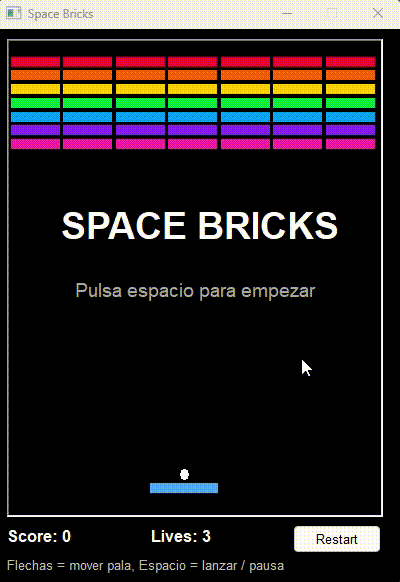

# 🧱 Pb_SpaceBricks — un Arkanoid en PowerBuilder (DataWindow y HTML5)




## 📋 ¿Qué es esto?

**Space Bricks** es un homenaje al clásico **Arkanoid**: un rompe-ladrillos
completamente jugable hecho en **PowerBuilder 2025**, y con un capricho que lo hace
especial — viene con **dos motores de renderizado**: una versión nativa con
**DataWindow** y otra en **HTML5 Canvas** corriendo dentro de un control WebBrowser.
Un menú principal te deja elegir con cuál jugar.

## ✨ Por qué lo hice

Después de montar el [Snake](../Pb_Snake_Dw) enterito dentro de un DataWindow, quería
exprimir más a PowerBuilder con un juego tipo Arkanoid/Breakout, que ya pide **físicas
de verdad**: movimiento continuo de la bola, rebotes en la pala según el ángulo y
detección de colisiones precisa.

El resultado son **dos versiones del mismo juego**:

- **PB nativo** — el juego corre sobre un DataWindow con rectángulos y óvalos creados
  dinámicamente, un evento `Timer` y `Modify()` para renderizar. Todo es PowerBuilder,
  sin tecnología externa.
- **HTML5** — el mismo juego reescrito en JavaScript plano con Canvas 2D, dentro del
  control `WebBrowser` de PB vía `NavigateToString()`. Animación suave a 60 FPS, pixel
  perfect. Sin frameworks, sin CDN, sin npm.

Una ventana lanzadera (`w_main`) te deja elegir qué versión jugar.

## 🎮 Cómo se juega

| Tecla | Acción |
|---|---|
| ⬅️ ➡️ | Mover la pala |
| `Espacio` | Lanzar bola / Pausa / Reanudar |
| Botón `Restart` | Partida nueva |

- Rompe las **7 filas de ladrillos de colores** (7 ladrillos por fila = 49 en total).
- La bola rebota en paredes, ladrillos y pala.
- El ángulo de la pala importa: golpea con los bordes para ángulos cerrados, con el
  centro para rebotes rectos.
- Tienes **3 vidas**. Si se te escapa la bola, pierdes una.

## 🧠 Cómo funciona

### Versión PB nativa (`w_spacebricks`)

El DataWindow `dw_spacebricks` usa **una sola fila** con **una única banda de detalle**
de 1870 PBU de alto — todo el campo de juego en una sola banda. La columna `cells` es
un `char(800)` donde cada carácter codifica una celda de la rejilla (21 columnas × 34
filas = 714 caracteres).

Al arrancar, `wf_init_grid()` crea:
- **49 rectángulos de ladrillo** en posiciones absolutas, con visibilidad y color
  enlazados a expresiones del DataWindow que leen de la cadena `cells`.
- **1 rectángulo de pala**, recolocado con `Modify("paddle.x = '…'")`.
- **1 óvalo de bola**, recolocado con `Modify("ball.x = '…' ball.y = '…'")`.

La bola se mueve en coordenadas PBU (no celda a celda), lo que da una animación más
suave. La detección de colisiones usa solape AABB con dirección de rebote por mínimo
solapamiento — el mismo algoritmo que la versión HTML.

### Versión HTML (`w_spacebricks_html`)

La función `wf_get_html()` devuelve el juego completo como una única cadena HTML. La
ventana la carga con `wb_1.NavigateToString(ls_html)`. El juego usa:
- JavaScript plano (sin frameworks, sin CDN).
- Canvas 2D renderizando a ~60 FPS con `requestAnimationFrame`.
- Movimiento basado en *delta-time* para velocidad constante.
- El mismo algoritmo de colisiones AABB + rebote por mínimo solapamiento.

### Lanzadera (`w_main`)

Un WebBrowser muestra una pantalla de bienvenida con dos tarjetas clicables. El
JavaScript llama a `window.webBrowser.ue_nativo()` o `window.webBrowser.ue_html()` vía
el mecanismo `RegisterEvent` de PB. Los eventos de usuario abren la ventana del juego
elegido y cierran la lanzadera.

## 🔄 Comparativa: nativo vs HTML

| | PB nativo | HTML5 |
|---|---|---|
| **Renderizado** | DataWindow `Modify()` | Canvas 2D |
| **FPS** | ~25 (Timer 40 ms) | ~60 (requestAnimationFrame) |
| **Movimiento bola** | Coordenadas PBU | Coordenadas píxel + delta time |
| **Colisiones** | AABB + mínimo solape | AABB + mínimo solape |
| **Control pala** | `keydown()` en Timer | `addEventListener` keydown/keyup |
| **Suavidad** | Buena | Excelente |

## 🛠️ Requisitos

- PowerBuilder **2025**.
- Sin base de datos ni recursos externos.

## ▶️ Cómo probarlo

1. Abre `Pb_SpaceBricks.pbsln` en **PowerBuilder 2025**.
2. Compila la solución.
3. Ejecuta — se abre la lanzadera, elige tu versión.

Se despliega como **PowerClient** (objeto de proyecto `pc_spacebricks`).

### 📁 Estructura del proyecto

```
Pb_SapaceBricks/
├── pb_spacebricks.pbl/
│   ├── pb_spacebricks.sra        ← objeto aplicación, abre w_main
│   ├── w_main.srw                ← lanzadera: elige PB nativo o HTML
│   ├── w_spacebricks.srw         ← juego PB nativo (DataWindow + Timer)
│   ├── dw_spacebricks.srd        ← definición del DataWindow (banda única)
│   ├── w_spacebricks_html.srw    ← juego HTML5 (WebBrowser + Canvas)
│   └── pc_spacebricks.srj        ← proyecto PowerClient
├── pb_spacebricks.pbproj
├── Pb_SpaceBricks.pbsln
├── LICENSE
└── README.md
```

## 🔗 Repo PowerBuilder

<https://github.com/rasanfe/Pb_SpaceBricks>

## 🙌 Créditos

La técnica de renderizado con DataWindow está inspirada en el [Snake](../Pb_Snake_Dw)
de este mismo conjunto de ejemplos, que a su vez bebe de las
[*Three Simple Games*](https://community.appeon.com/codeexchange/powerbuilder/114-three-simple-games)
de **René Ullrich** en Appeon CodeExchange.

Este proyecto fue desarrollado por **Claude Code** siguiendo mis ideas y dirección.

## 📜 Licencia

[MIT](LICENSE) © 2026 Ramón San Félix Ramón

---

> ¡Nos vemos en el próximo artículo! Y recuerda: en PowerBuilder, los límites solo están en nuestra imaginación. 🚀

📨 **Blog:** <https://rsrsystem.blogspot.com/>
